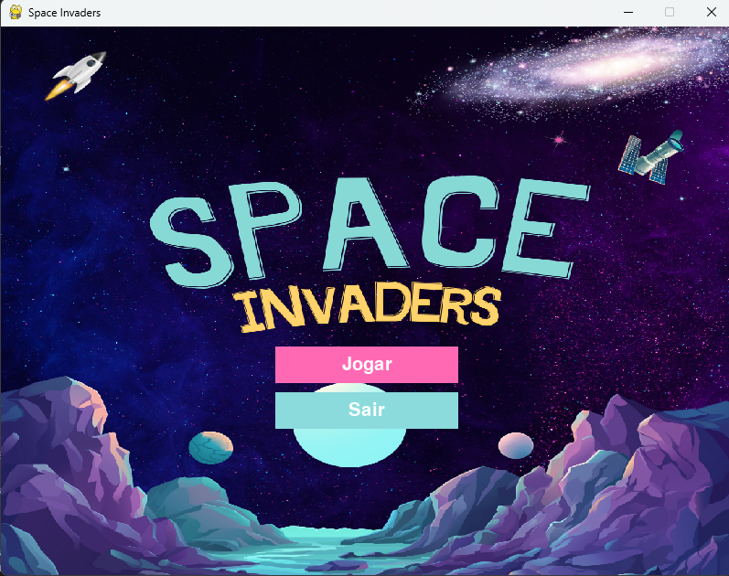
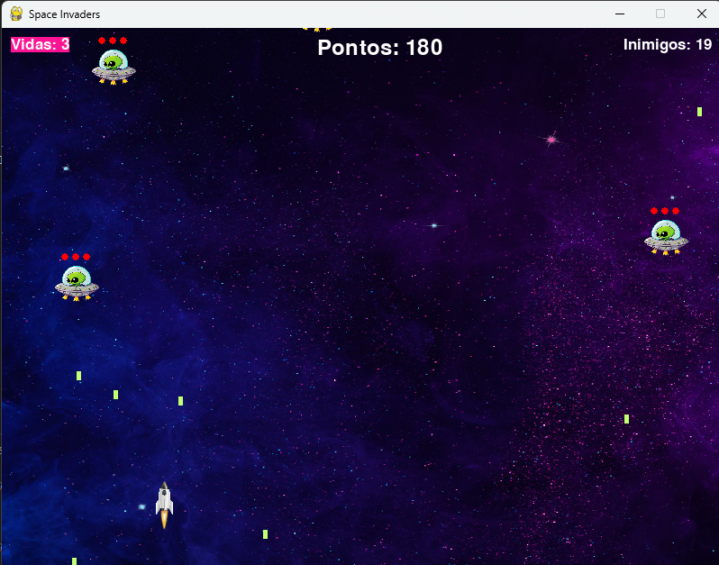

# Space Invaders



Este é um jogo de Space Invaders desenvolvido em Python usando a biblioteca Pygame. Este trabalho foi desenvolvido para a disciplina de Linguagem de Programação I do curso de Engenharia da Computação da Faculdade Dom Alberto.

## Como Jogar

1. Execute o jogo:
    ```sh
    python game.py
    ```
2. Use as setas do teclado para mover a nave:
    - **Esquerda**: Mover para a esquerda
    - **Direita**: Mover para a direita
    - **Cima**: Mover para cima
    - **Baixo**: Mover para baixo
3. Pressione a barra de espaço para atirar.

## Estrutura do Projeto

- `game.py`: Arquivo principal do jogo.
- `enemies.py`: Contém funções relacionadas aos inimigos.
- `draw.py`: Contém funções para desenhar elementos na tela.
- `settings.py`: Contém configurações gerais do jogo, como cores, imagens e sons.
- `sound.py`: Contém funções relacionadas ao som.
- `sources/`: Diretório que contém os arquivos de imagem e som.

## Funcionalidades

- Movimentação da nave.
- Tiros da nave e dos inimigos.
- Colisão entre tiros e inimigos.
- Contagem de pontuação.
- Tela de vitória e derrota.

## Regras do Jogo

- O jogo termina quando uma nave invasora tocar a base defensora, quando a nave defensora destruir todas as naves inimigas ou quando a nave defensora for atingida mais de três vezes por disparos inimigos.
- O jogo inicia com uma pontuação de 50. A cada tiro acertado no inimigo, ganha 10 pontos. Se matar o inimigo, ganha 100 pontos. Perde pontos se for atingido.
- Tanto o inimigo como a nave possuem 3 vidas.

